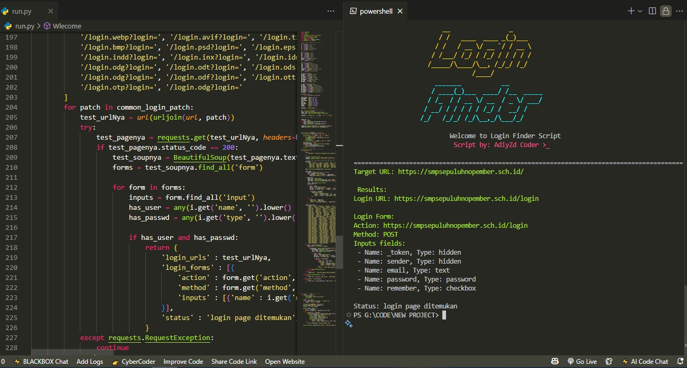

# 🔍 Login Finder

[](https://www.python.org/)
[](https://opensource.org/licenses/MIT)
[](https://github.com/AdiyZd/Login-Finder)

Tool Python untuk mendeteksi halaman login pada website menggunakan `requests` dan `BeautifulSoup`.



## 🛠️ Instalasi

### Metode 1: Instalasi Otomatis
```bash
git clone https://github.com/AdiyZd/Login-Finder.git
cd Login-Finder
python3 installasi.py
